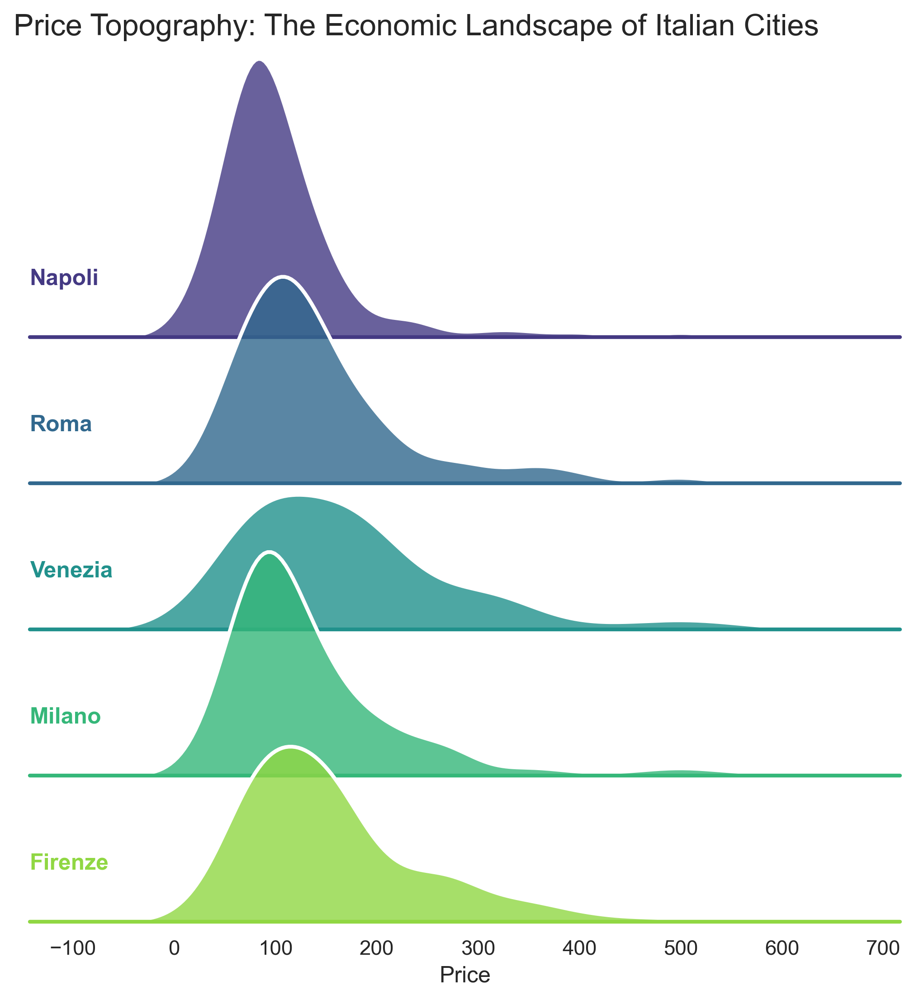
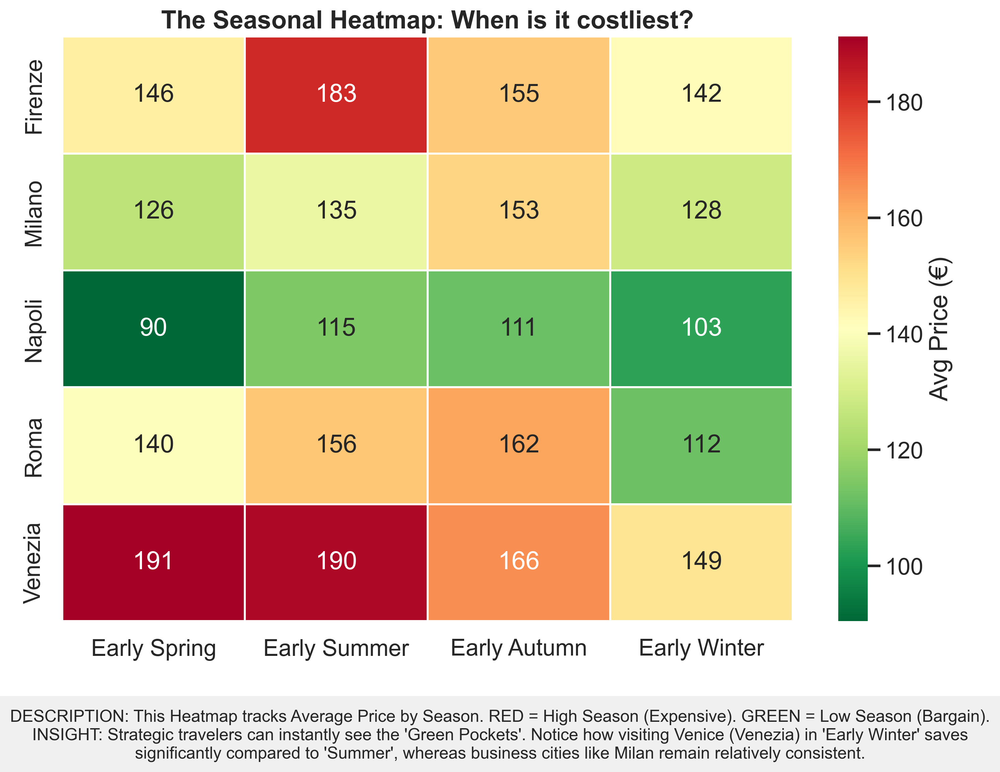
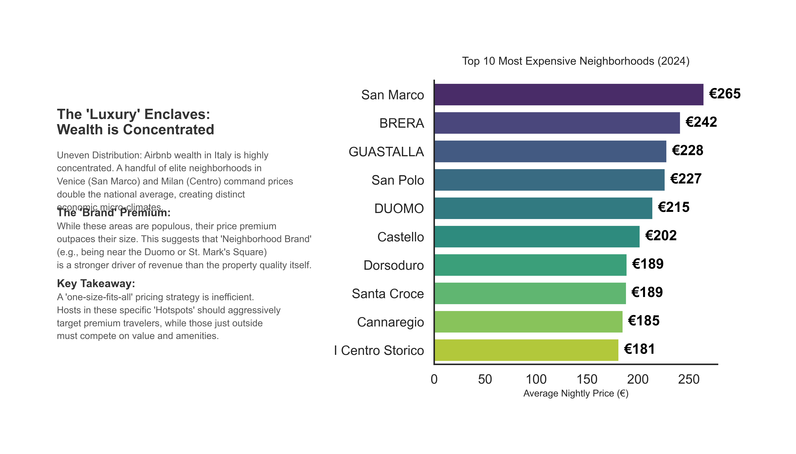

# Data Visualization Project - Italian Airbnb Market Analysis

## 📊 Project Overview

This project provides comprehensive data analysis and visualization of the Airbnb market across Italian cities, focusing on seasonal pricing patterns, market dynamics, and strategic insights for both property investors and travelers.

## 🎯 Quick Start

### Main Components
1. **Analysis Notebook**: `project python script.ipynb` - Complete data analysis and visualization code
2. **Documentation**: `PROJECT_DOCUMENTATION.md` - Comprehensive project documentation
3. **Dataset**: `airbnbitaly_dm.csv` - Italian Airbnb market data
4. **Key Visualizations**:
   - `visual_1_ridgeline.png` - Price distribution across cities
   - `selected_visual_2_heatmap.png` - Seasonal pricing matrix
   - `slide_layout_top10_corrected.png` - Top 10 cities analysis

## 📈 Key Visualizations

### 1. Ridgeline Plot - Price Distributions


Shows overlapping density curves of price distributions for different Italian cities, enabling easy comparison of market structures.

### 2. Heatmap - Seasonal Pricing Matrix


Color-coded matrix displaying average prices across cities and seasons. Darker colors indicate higher prices, revealing seasonal patterns at a glance.

### 3. Top 10 Cities Layout


Comprehensive dashboard showing rankings, statistics, and comparative analysis of the top Italian Airbnb markets.

## 🔍 What You'll Find

### Analysis Features
- **Seasonal Pricing Patterns**: How prices vary throughout the year
- **Market Segmentation**: Luxury, mid-range, and budget tiers
- **Geographic Insights**: City-by-city market characteristics
- **Statistical Analysis**: Distribution metrics, trends, and correlations
- **Strategic Recommendations**: For investors and travelers

### Key Insights
- Summer typically sees 20-40% price increases
- Venice maintains consistent high pricing year-round
- Shoulder seasons offer the best value
- Business-focused cities show more pricing stability

## 🛠️ Setup and Usage

### Requirements
```bash
pip install pandas numpy matplotlib seaborn scipy jupyter
```

### Running the Analysis
```bash
jupyter notebook
# Open 'project python script.ipynb'
# Run all cells
```

## 📚 Documentation

For detailed information, please refer to:
- **[PROJECT_DOCUMENTATION.md](PROJECT_DOCUMENTATION.md)** - Complete documentation including:
  - Detailed visualization explanations
  - Technical implementation guide
  - Data analysis methodology
  - Reproducibility instructions
  - Strategic insights and recommendations

## 🎓 Use Cases

### For Property Investors
- Identify high-yield markets
- Optimize seasonal pricing strategies
- Evaluate competition and opportunities
- Understand market dynamics

### For Travelers
- Find best booking times
- Compare value across cities
- Plan optimal travel periods
- Maximize budget efficiency

### For Data Enthusiasts
- Learn data visualization techniques
- Understand heatmap and ridgeline plots
- Study seasonal analysis methods
- Practice with real-world dataset

## 📊 Dataset Information

- **Source**: Airbnb Italy market data
- **Cities Covered**: Major Italian tourist destinations including Venice, Rome, Florence, Milan, and more
- **Variables**: City, Season, Price, Room Type, Capacity, Superhost status, and others
- **Time Period**: Multiple seasons (Spring, Summer, Autumn, Winter)

## 🚀 Features

### Visualization Techniques
- **Ridgeline Plots**: Overlapping density distributions
- **Heatmaps**: Color-coded seasonal matrices
- **Statistical Charts**: Distribution analysis and comparisons
- **Professional Layouts**: Publication-ready slide designs

### Analysis Methods
- Descriptive statistics
- Seasonal decomposition
- Market segmentation
- Outlier detection and handling
- Comparative analysis

## 📁 Project Structure

```
datavisualization-project/
├── project python script.ipynb      # Main analysis notebook
├── PROJECT_DOCUMENTATION.md         # Detailed documentation
├── README.md                        # This file
├── airbnbitaly_dm.csv              # Main dataset
├── sample_airbnbitaly_dm.csv       # Sample data
├── visual_1_ridgeline.png          # Key visualization 1
├── selected_visual_2_heatmap.png   # Key visualization 2
└── slide_layout_top10_corrected.png # Key visualization 3
```

## 🤝 Contributing

This is an educational/analytical project. Feel free to:
- Explore the analysis
- Modify visualizations
- Extend the analysis with new techniques
- Use as a learning resource

## 📝 Notes

- All visualizations are generated using Python libraries (matplotlib, seaborn)
- The analysis focuses on price patterns and market dynamics
- Data has been cleaned to remove outliers (prices > €600)
- Professional slide layouts are designed for presentation purposes

## 📞 Support

For detailed information on any aspect of the project:
1. Check `PROJECT_DOCUMENTATION.md` for comprehensive explanations
2. Review code comments in `project python script.ipynb`
3. Examine the generated visualizations
4. Verify data in the CSV files

## 🎯 Learning Outcomes

By studying this project, you will learn:
- How to perform exploratory data analysis
- Creating effective data visualizations
- Interpreting seasonal patterns
- Building professional presentation layouts
- Working with real-world tourism/pricing data
- Applying statistical analysis techniques

## 📅 Version

**Version**: 1.0  
**Last Updated**: January 2025

---

**Quick Links**:
- [View Complete Documentation](PROJECT_DOCUMENTATION.md)
- [Open Jupyter Notebook](project%20python%20script.ipynb)
- [Dataset](airbnbitaly_dm.csv)

---

*This project demonstrates professional data analysis and visualization techniques for market research and strategic planning.*
